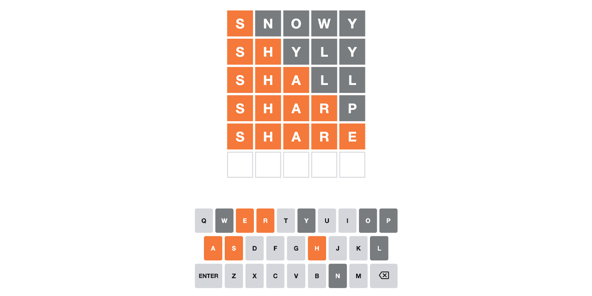
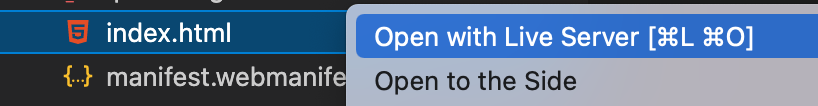
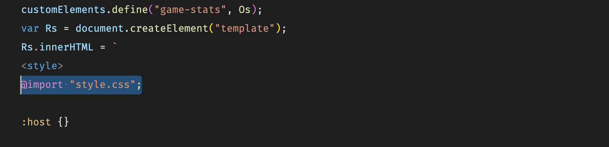
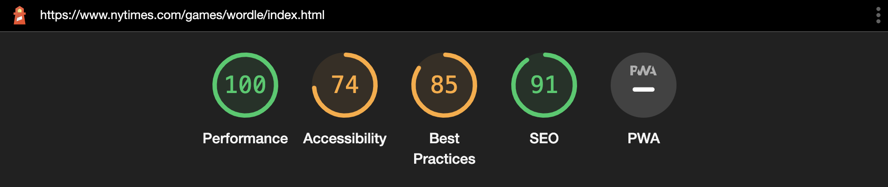
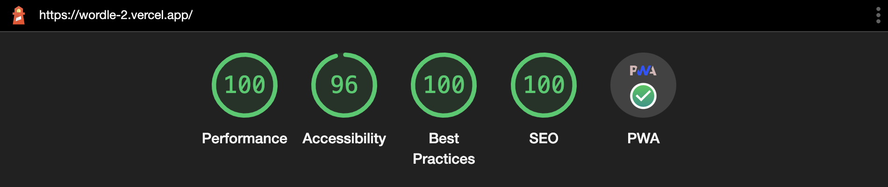
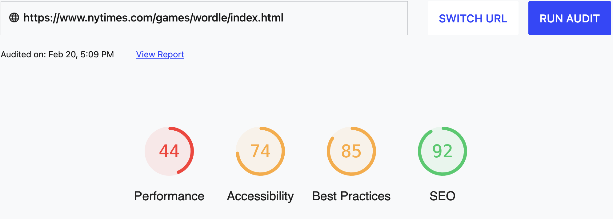
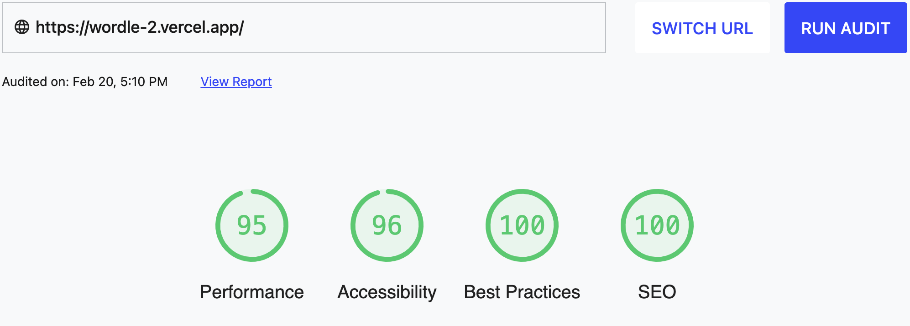

<p id="header"><p>

<table><tr>
<td> <a href="https://github.com/emjose/design-patterns-101/#header"></a> </td>
<td> <a href="https://github.com/emjose/one-hundred/#header"></a> </td>
<td> <a href="https://github.com/emjose/inspectext/#header"></a> </td>

</tr></table>

<br>

<p id="project-title"><p>

<a href=#table-of-contents></a>

<br>

<a href="https://wordle-2.vercel.app/"></a>

#

<p id="table-of-contents"><p>

<a href=#table-of-contents></a>

-   [100 Days of Code](#100days)
-   [Installation](#installation)
-   [Live Site](#live-site)
-   [Modifications](#modifications)

    -   [Functionality](#functionality)

    -   [Organization](#organization)

    -   [Performance](#performance)

-   [Resources](#resources)
-   [Copyright](#copyright)
-   [Let's Connect!](#lets-connect)

#

<p id="100days"><p>

<a href=#100days></a>

### Day 34: February 13, 2022

-   The online game **[Wordle](https://www.nytimes.com/games/wordle/index.html)** by developer [Josh Wardle](https://powerlanguage.co.uk/) became a viral phenomenon in late 2021.

-   When [The NY Times](https://www.nytimes.com/) purchased Wordle, I downloaded its open source code for offline play.

-   I started to explore and tinker with the code. To play the game without the daily restriction, I used solutions from developers who had archived and reverse-engineered Wordle.

-   **Wordle 2 is an adapted and modified clone of Wordle,** with the following features:

    -   [Progressive Web App](https://web.dev/progressive-web-apps/) status and unlimited play
    -   Principles of [Separation of Concerns](https://en.wikipedia.org/wiki/Separation_of_concerns) for HTML, JavaScript, and CSS
    -   Optimized metrics for [Web.Dev Page Quality](https://web.dev/measure/) and [Chrome DevTools Lighthouse](https://developers.google.com/web/tools/lighthouse) audit reports

#

<p id="installation"><p>

<a href=#installation></a>

#### Git clone and cd into the repo folder:

```
git clone git@github.com:emjose/wordle-2.git && cd wordle-2
```

#### Right-click on the index.html file and select `Open with Live Server`

<a href=#installation></a>

#

<p id="live-site"><p>

<a href="https://wordle-2.vercel.app/"></a>

<a href="https://wordle-2.vercel.app/"></a>

-   Like the original, **[Wordle 2](https://wordle-2.vercel.app/)** has Hard Mode, Dark Theme, and Color Blind Mode.

-   Key buttons have visual indication, and are keyboard navigable by pressing the `tab` key.

-   **Note:** the `enter` key can only be used for submitting a complete word, not for pressing a letter key.

<br>
<br>

<a href="https://wordle-2.vercel.app/"></a>

-   A new game can be immediately initiated, with results tracked in the statistics modal.

-   The Wordle share button was refactored into the refresh / new game button.

#

<p id="modifications"><p>

<a href=#modifications></a>

-   [Wordle](https://www.nytimes.com/games/wordle/index.html) is an excellent game, and the intention of [Wordle 2](https://wordle-2.vercel.app/) is not to reinvent the wheel, but to realign it.

-   Wordle 2 differs from the original in these areas, with ongoing plans for further education and improvement.
    <br>
    <br>

<p id="functionality"><p>

## Functionality

-   The date limit was removed and the share button was refactored, enabling unlimited play.

-   For Wordle's source code and functionality, all credit belongs to Wordle's creator, [Josh Wardle](https://www.powerlanguage.co.uk/).

-   For unlimited play, all credit belongs to these developers and their open source contributions:
    -   [Josh Wardle on Github](https://github.com/powerlanguage)
    -   [Wordle Unlimited](https://github.com/CicadaCinema/wordle-unlimited) by [CicadaCinema](https://github.com/CicadaCinema)
    -   [Wordle Archive](https://github.com/tylerdak/wordle-archive) by [Tyler Dakin](https://github.com/tylerdak)
    -   [Jordle](https://github.com/jordangarcia/jordle) by [Jordan Garcia](https://github.com/jordangarcia)
    -   [Wordle](https://github.com/katacarbix/wordle) by [Reese Jacobson](https://github.com/katacarbix)
    -   [Hello Wordl](https://github.com/lynn/hello-wordl) by [Lynn](https://github.com/lynn), [Mcpower](https://github.com/mcpower), [Daniel Kunkler](https://github.com/dskunkler), [Matt Brubeck](https://github.com/mbrubeck), [Willie Zhu](https://github.com/zhuwxyz), [Saurab S](https://github.com/ssaurab)
    -   [Reverse Engineering Wordle](https://reichel.dev/blog/reverse-engineering-wordle.html) by [Robert Reichel](https://reichel.dev/)
    -   [Un-Wordle](https://github.com/SferaDev/un-wordle) by [Alexis Rico](https://github.com/SferaDev)
        <br>
        <br>

<p id="organization"><p>

## Organization

-   The original Wordle source code uses [Web Components](https://developer.mozilla.org/en-US/docs/Web/Web_Components), [ShadowRoot](https://developer.mozilla.org/en-US/docs/Web/API/ShadowRoot) and the [Shadow DOM](https://developer.mozilla.org/en-US/docs/Web/Web_Components/Using_shadow_DOM).

-   In simple terms, the Shadow DOM introduces [locally scoped styles](https://developers.google.com/web/fundamentals/web-components/shadowdom) in custom elements:

    -   Local styles don't collide with global styles
    -   HTML and CSS can be bundled / encapsulated in the same element

-   The original Wordle has no stylesheet. Over 700 lines of CSS are embedded in HTML and JavaScript.

-   Admittedly, I was having difficulty understanding the bundling of HTML, JavaScript, and CSS in the code.

-   For personal clarity, organization, and [Separation of Concerns](https://en.wikipedia.org/wiki/Separation_of_concerns), **Wordle 2 has a dedicated CSS stylesheet**.
    <br>
    <br>

#### In the script.js file:

<a href=#organization></a>

-   The CSS stylesheet is imported into the [ShadowRoot](https://developer.mozilla.org/en-US/docs/Web/API/ShadowRoot) elements.

-   Any styling dependent on the [:host](https://developer.mozilla.org/en-US/docs/Web/CSS/:host) pseudo-class remains in the script.js file.
    <br>
    <br>

<p id="performance"><p>

## Performance

-   [Lighthouse](https://developers.google.com/web/tools/lighthouse/#devtools) and [Web.Dev](https://web.dev/measure/) metrics are optimized in Wordle 2.

-   Buttons have accessible names and keyboard-only navigation is enabled.

-   Modal text is enlarged and zooming is enabled for users who rely on screen magnification.

-   For status as a [Progressive Web App](https://web.dev/progressive-web-apps/?gclid=CjwKCAiA6seQBhAfEiwAvPqu157Tk6Kj43kGXajzhrimuKxHghZDE0-GQdgq12O2ZRIspckMVyaaqRoCzqAQAvD_BwE), a service worker, a web manifest, icons, and meta tags are all present.

#

### <span>Comparison:</span> [Chrome DevTools Lighthouse](https://developers.google.com/web/tools/lighthouse/#devtools)

<br>

**[Wordle - The New York Times](https://www.nytimes.com/games/wordle/index.html)**

<a href=#performance></a>

**[Wordle 2](https://wordle-2.vercel.app/)**

<a href=#performance></a>

#

### <span>Comparison:</span> [Web.Dev Page Quality](https://web.dev/measure/)

<br>

**[Wordle - The New York Times](https://www.nytimes.com/games/wordle/index.html)**

<a href=#performance></a>

**[Wordle 2](https://wordle-2.vercel.app/)**

<a href=#performance></a>

#

<p id="resources"><p>

<a href=#resources></a>

-   #### [Wordle](https://www.nytimes.com/games/wordle/index.html)

-   #### [Josh Wardle](https://www.powerlanguage.co.uk/)

-   #### [Adobe Photoshop](https://www.adobe.com/creativecloud/buy/students.html)

-   #### [Favicon Generator](https://favicon.io/)

-   #### [Web App Manifests](https://developer.mozilla.org/en-US/docs/Web/Manifest)

-   #### [Shadow DOM styling](https://javascript.info/shadow-dom-style)

-   #### [Separation of Concerns](https://www.oreilly.com/library/view/programming-javascript-applications/9781491950289/ch05.html)

-   #### [Service Workers: An Introduction](https://developers.google.com/web/fundamentals/primers/service-workers)

-   #### [The Quirks of Shadow DOM and How to Take Advantage of Them](https://dev.to/alangdm/the-quirks-of-shadow-dom-and-how-to-take-advantage-of-them-4cd1)

-   #### [My blog on how I created my Github READMEs](https://emmanueljose.medium.com/readme-a-makeover-story-b9c7be37a6de?sk=7ae6623d365409d875753e4604e42ffd)

#

<p id="copyright"><p>

<a href=#copyright></a>

-   This project is for made for educational purposes only.

-   Wordle is copyright of © [Josh Wardle](https://www.powerlanguage.co.uk/) and © [The New York Times Company](https://www.nytco.com/). All Rights Reserved.

#

<p id="lets-connect"><p>

<a href=#lets-connect></a>

<p><a href="https://twitter.com/Emmanuel_Labor"> <a href="https://www.linkedin.com/in/emmanuelpjose/"> <a href="https://emmanueljose.medium.com/"> <a href="https://www.instagram.com/emmanuel_jose/"> <a href="mailto:emjose@gmail.com"> <a href="https://www.emmanuel-jose.com/"> <a href="https://github.com/emjose"></p>

#

<a href=#header></a>
